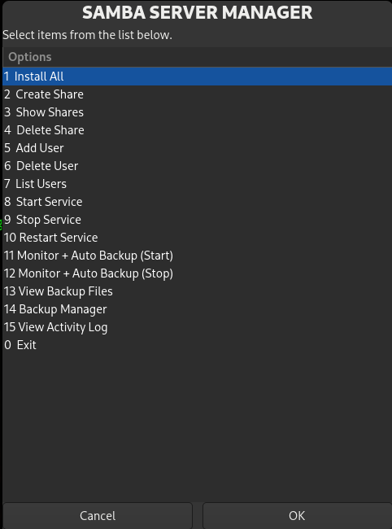

# 📦 Samba Server Manager


A Bash-based GUI tool that simplifies Samba server configuration and management on Linux systems. Built with **Zenity**, it allows you to manage shares, users, services, and backups without manually editing configuration files.

---

## 🚀 Features

* 🔧 **One-click Installation**
  Automatically installs required packages and prepares the environment

* 📁 **Share Management**
  Create, view, and delete Samba shares (public & private)

* 👤 **User Management**
  Add, delete, and list Samba users with validation

* ⚙️ **Service Control**
  Start, stop, and restart Samba services easily

* 🔄 **Auto Backup & Monitoring**
  Monitor folders in real-time and create automatic backups

* 🗂️ **Backup Manager**
  View, inspect, and restore backup files

* 📜 **Activity Logging**
  Track system activities and backup operations

---

## 🖼️ Interface

The tool provides a clean, menu-driven GUI using Zenity for easy interaction.

---

## ⚙️ How It Works

This script automates Samba administration by interacting directly with system configurations like:

* `/etc/samba/smb.conf`
* `smbpasswd` for user management
* File system permissions and backup handling

All operations are performed securely with root privileges.

---

## 🛠️ Requirements

* Linux (Ubuntu/Debian recommended)
* Root privileges (`sudo`)
* Dependencies:

  * samba
  * zenity
  * inotify-tools

---

## ▶️ Installation & Usage

```bash
git clone https://github.com/your-username/samba-server-manager.git
cd samba-server-manager
chmod +x samba-server.sh
sudo ./samba-server.sh
```

---

## 📌 Notes

* Must be run with **sudo**
* Automatically creates:

  * `/samba` → shared folders
  * `/var/backups/samba` → backup storage
  * `/var/log/samba_gui.log` → logs

---

## 🤖 AI Assistance

This project was developed with assistance from AI tools like Claude and ChatGPT for code generation, debugging, and optimization.

---

## ⚠️ Disclaimer

This tool modifies system-level configurations. Use it carefully, especially in production environments. Always keep backups before making changes.

---

## 👨‍💻 Author

**Sunjid Ahmed Siyem**
Cybersecurity Enthusiast | CSE Student

---

## ⭐ Support

If you like this project, give it a ⭐ on GitHub!

---
